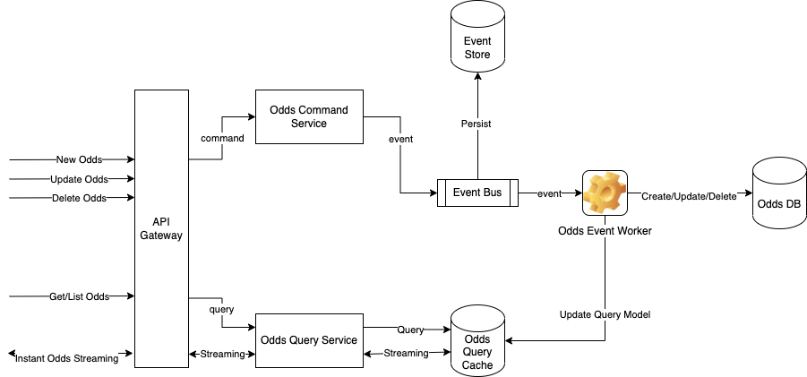
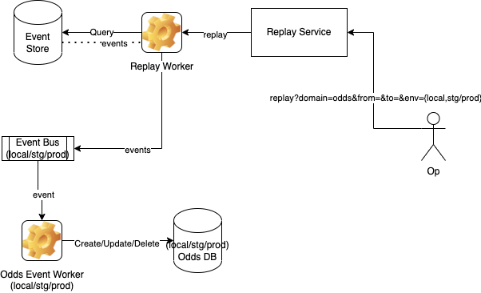
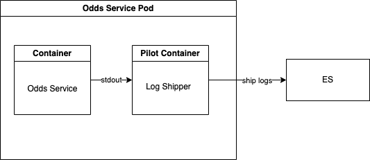

# CQRS + event sourcing practise
## System Diagram


## Data Model
### Data Transfer Model
- CommandRequest
```
{
  RequestID: string
  Provider: string
  Command: enum {NewOdds|UpdateOdds|DeleteOdds}
  Domain: enum {Odds}
  EventVelocity: enum {high|low|medium} default medium
  Payload: {
    GameID: string
    MoneyLine?: {
      Home: float
      Away: float
      Draw: float
    }
  }
}
```

- CommandResponse
```
{
  RequestID: string
  Status: enum {success|fail}
  Msg: string
}
```

- QueryRequest
```
{
  RequestID: string
  Query: enum {GetOdds,ListOdds}
  Domain: enum {Odds}
  Params: {
    ID?: bigint
    PageNo?: int
    PageSize?: int
    ...
  }
}
```

- QueryResponse
```
{
  RequestID: string
  Status: enum {success|fail}
  Msg: string
  Data: any
}
```

### Event Transfer Model
- Event
```
{
  EventID: uuid
  Domain: enum {Odds}
  Payload: CommandRequest
  CreatedAt: unix_timestamp
}
```

### Data Persist Model
- Odds
```
{
  ID: bigint auto_increment
  ExternalID: uuid
  GameID: string
  MoneyLine: {
    Home: float
    Away: float
    Draw: float
  }
  Deleted: bool
  CreatedAt: unix_timestamp
  UpdatedAt: unix_timestamp
}
```

- OddsEventLog
```
{
  ID: bigint auto_increment
  OddsID: bigint
  EventID: uuid
  CreatedAt: unix_timestamp
}
```

- Event
```
{
  ID: bigint auto_increment
  EventID: uuid
  Domain: enum {Odds}
  Payload: CommandRequest
  CreatedAt: unix_timestamp
}
```

## APIs
### Command APIs
- New Odds
```
POST /odds
Reuqest Body: CommandRequest
```

- Update Odds
```
PATCH /odds/:external_id
Request Body: CommandRequest
```

- Delete Odds
```
DELETE /odds/:external_id
Reuqest Body: CommandRequest
```

### Query APIs
- List Odds
```
GET /odds?page_no=&page_size=
```

- Get Odds detail
```
GET /odds/:external_id
```

- Get Instant Odds ([Ref](https://github.com/eedkevin/flight-ticket/blob/main/src/graphql/resolvers/flight.ts#L21))
```GraphQL
POST api/graphql
Request Body:

subscription {
  getInstantOdds {
    id
    external_id
    game_id
    moneyline
    created_at
    updated_at
  }
}
```

## Event Sourcing
### Event Bus
Due to the requirement of different game types, event buses can be categorised as following. More detailed granularity can help speed up the high frequency queue. While less detailed granularity can be used for medium/low frequentcy queues for cost efficiency

#### High Frequency Events
- dedicated queue per game type per domain
#### Medium Frequency Events
- shared queue per game type
#### Low Frequency Events
- shared queue

### Event Bus Implementation
- nats
- Kafka
- Google Cloud Sub/Pub
- aws SQS
- or UDP based MQ like Aeron for throughput and latency

nats is more golang-friendly when comparing with kafka. while kafka still be the best bet on availability and partition tolerance (in CAP model)

Google Cloud Sub/Pub or aws SQS might be the best choice in terms of maintainablity

If lower latency is extreme important to the system, it's worth a try on UDP based message queue like Aeron

### Event Store Implementation
- cassandra
- aws dynamoDB
- google Datastore

Cassandra uses a different replication approach other than master/slave mode which avoids better on single point failures, but with a higher maintainence cost comparing to dynamoDB or Datastore

aws dynamoDB has a better performance than google Datastore in both latency and throughput. but if all the other stacks are on google, maybe it's not that bad on choosing google Datastore with knowing the performance is still very outstanding [ref here](https://medium.com/@wattanai.tha/nosql-cloud-service-benchmarking-dynamodb-vs-datastore-3f57b6951fb)

## Replayability

### Disaster Recovery
The production database can be recovered by replaying the events from the persistent event store
### Debugging on Local/Staging Env
Developers can take the advantage of replaying the events to local database and ease debugging when porting the `Replay Worker` to the `Local Event Bus` and thus `Local DB`
### Extendability
New sub systems/components may also take the advantage of using the persistent event store to sync data to its dedicated database

## Logging
Print the necessary applicaton logs to stdout, the container runtime will forward them to container's stdout. meanwhile, A pilot container with a log shipper deployed inside can listen to that stdout and then be able to ship the logs to monitoring systems like ES/Kibana


## Data Serialize/Deserialize
protobuf can be very helpful on saving the bandwidth and thus higher performance when being used in transfering data between services
